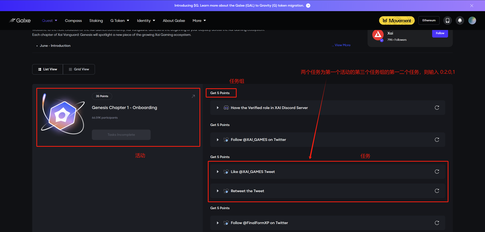

# Galxe Task Automation

后面已完成如下功能，后续会加入更多交互：

- EVM 地址登录
- 创建 GalxeID 账号
- 绑定邮箱：1secmail
- 绑定推特 - auth_token
- 绑定 Taproot 地址
- 完成任务
- 章节奖励领取
- Geetest 自动验证：2captcha（现在经常报错）、capsolver（推荐）

## 支持任务

- 校验任务
- 问卷任务
- 推特任务（点赞、转发、发推 @ 好友、关注）
- 浏览任务
- 关注银河 space 任务

## 配置参数

GALXE_COLLECT：银河合集 id，可以通过 URL 获取。如 https://app.galxe.com/quest/Babylon/GCyyntz73L 则为 GCyyntz73L。

GALXE_CAMPAIGNS_INDEXES：执行任务下标，从 0 开始计算，`:`分隔活动、任务组、任务，`,` 分隔不同任务。

```
# 可测试任务的活动
# 问卷+浏览
GALXE_COLLECT="GC4Uwtd8Hr"
GALXE_CAMPAIGNS_INDEXES="0:0:2,3,4"

# 推特
GALXE_COLLECT="GCzuatdz2R"
GALXE_CAMPAIGNS_INDEXES="0:2:0,1"

# 关注 space
GALXE_COLLECT="GCBxytgdNB"
GALXE_CAMPAIGNS_INDEXES="3:0:0"
```



## 运行

复制 `.env.example` 改名为 `.env`，填写相关配置参数，运行过程会遍历助记词对应的派生地址，然后逐步完成任务。

```bash
npm i
npm run start
```

## 后续规划

会持续做好银河相关任务的迭代和优化：如 奥德赛、dc、多活动领取等，开源脚本完善之后会升级成可视化的银河自动化平台。

### 感谢关注: [@Kunsect](https://x.com/kunsect7)
